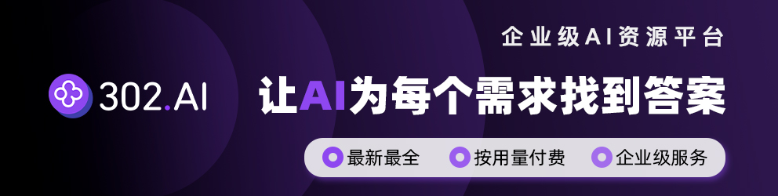

<h1 align="center">🤖 MathModelAgent 📐</h1>
<p align="center">
    
</p>
<h4 align="center">
    专为数学建模设计的 Agent<br>
    自动完成数学建模、代码执行和论文候选稿生成；正式提交前仍需人工复核模型与排版。
</h4>

<h5 align="center">简体中文 | <a href="README_EN.md">English</a></h5>

## 🌟 愿景：

3 天的比赛时间变为 1 小时
自动完整一份可以获奖级别的建模论文

<p align="center">
    
    
</p>

## ✨ 功能特性

- 🔍 自动分析问题，数学建模，编写代码，纠正错误，撰写论文
- 💻 Code Interpreter
    - 云端 code interpreter: [E2B](https://e2b.dev/)（默认且必需；缺少 `E2B_API_KEY` 时安全失败，不自动降级）
    - local Interpreter: 基于 Jupyter，仅在显式 `ALLOW_LOCAL_CODE_EXECUTION=true` 的受信任隔离开发环境使用
- 📝 生成 Markdown / DOCX / PDF / LaTeX sidecar 候选论文与审计报告
- 🤝 multi-agents: 建模手，代码手，论文手等
- 🔄 multi-llms: 每个 agent 设置不同的、合适的模型
- 🤖 内置 OpenAI Chat Completions、OpenAI Responses、Anthropic；OpenAI-compatible 网关可通过 `base_url` 配置。当前未集成 LiteLLM 运行时
- 💰 成本低：workflow agentless，不依赖 agent 框架
- 🧩 自定义模板：prompt inject 为每个 subtask 单独设置需求
- 🌐 文献与网页检索：Writer 的 `search_papers` 聚合 OpenAlex、Semantic Scholar、Crossref、arXiv；Tavily 仅在 `SEARCH_ENABLED=true` 且 `TAVILY_API_KEY` 存在时作为网页资料补充
- 📚 RAG 知识库：配置项已预留，但主工作流尚未接入 ChromaDB/Rerank 检索
- 🤝 HIL 人机协作：当前只实现 `HUMAN_MODEL_GATE_ENABLED` 的建模方案确认门禁；通用 6 种动作尚未接入前端/工作流
- 🛡️ 容错与续传：已实现基础重试、错误反思、断点续传、早期失败请求快照、重启中断恢复和变量快照；Fallback Hand Off / Evaluator Shadow Mode / Feedback Rerun 尚未形成完整闭环

## 当前代码实现状态（2026-07-13 核对）

- 已实现：FastAPI/Vue WebUI 主流程、默认 E2B 隔离代码执行、OpenAI/Responses/Anthropic provider、断点续传（含早期失败请求快照与重启中断恢复）、变量快照、实时消息注入、多源文献检索、建模方案审批、任务文件打包下载、token 聚合统计、CUMCM2026 导出和提交审计。
- 有明确边界：`/save-api-config` 只修改当前进程配置，前后端都不持久化浏览器填写的密钥；`/track` 是 best-effort 单进程聚合，不是供应商账单。Docker 默认仅监听本机，任务文件下载受单文件名和附件策略限制。CUMCM 2026 默认会把完整可运行脚本和 notebook 代码单元写入附录 B，并以 `final_acceptance_report.json -> complete_source_appendix` 核验覆盖与哈希；只有显式启用 `paper_appendix_config.json -> mode=key` 才仅展示核心摘录，且该模式不能得到 `TECHNICAL_PASS`。技术通过仍不替代人工运行源码、复核数学与确认最终提交规则。
- 未接入主流程：RAG、通用 HIL 6 种动作、Fallback Hand Off、Evaluator Shadow Mode、Feedback Rerun、Daytona、LiteLLM runtime、视觉模型、R/MATLAB 执行链路。
- 最近验证：Docker 容器内后端单测、Ruff（含安全规则）、Bandit、pip-audit、前端 TypeScript/生产构建和生产依赖审计均已运行；Windows 本机 Node 工具链仍不主动使用。


---
---

我在平台中托管了一个在线版本，方便使用，欢迎体验：

https://mathmodel.top/home

## SKILLS 资源（实验性，非 WebUI 主流程）

本仓库同时包含 FastAPI/Vue WebUI 主应用和 `skills/` 目录下的实验性技能资源。
当前 WebUI 主流程仍由 `backend/app/core/workflow.py` 编排，并非完全由 SKILLS 驱动；Typst 模板/技能资源不等同于 WebUI 默认导出链路。

### Intro

以下内容描述 `skills/` 目录中的实验性技能资产，使用时需要和 WebUI/Docker 主流程分开看。

**💰 开源免费，接入任意模型**
项目开源免费；当前 WebUI 运行时代码内置 OpenAI Chat Completions、OpenAI Responses、Anthropic 和 OpenAI-compatible 配置，不等同于“任意模型已全部适配”。

**🧠 端到端自动化**
skills 侧目标是从问题分析、建模、编码、绘图到论文排版和验收串联执行；WebUI 主流程已实现建模、代码执行、写作、导出和审计，但正式提交仍需人工复核。

**📄 Typst 论文模板资源**
`skills/` 侧包含 Typst 模板资源和赛事模板探索；WebUI 默认导出链路当前是 Markdown / DOCX / PDF / LaTeX sidecar，不使用 Typst 作为主导出引擎。

**📐 建模知识资源**
skills 侧可沉淀建模规范、模型选择、易错模式和评分标准；WebUI 主工作流目前未接入 RAG/ChromaDB/Rerank 知识库检索。

**✅ 验收与审计**
WebUI 主流程当前使用 `paper_preflight_report`、`pdf_visual_check`、`submission_audit_report` 等审计文件；Typst 侧 9 步验收属于 skills 资源目标，不代表 WebUI 已默认执行 Typst 编译。

**🔒 实验性证据链门禁**
skills 工作流新增 `2a-method-validation`、`3a-result-freeze` 与
`6a-independent-audit`：分别用于小型方法 PoC 与人工选型、关键数值及来源哈希冻结、
以及独立可追溯审计。`1start-mathmodel` 会用本地 workflow guard 指示恢复位置。
这些工件仅写入正在处理的 skill 工作区；它们不改变 FastAPI/Vue WebUI 的默认
Coordinator/Modeler/Coder/Writer 流程、导出 profile 或提交审计口径，也不证明数学模型正确。

**🧭 渐进式路由与 Codex 分发**
`skills/_references/references/algorithm-routing.md` 会先按题型路由，再按需加载规范库章节，
避免把全部算法资料塞入单次上下文。仓库根目录的 `.codex-plugin/plugin.json` 可将现有
`skills/` 作为 Codex plugin 分发；它不创建个人 marketplace、不自动安装，也不改变 WebUI。

**🔧 可组合、可扩展**
skills 资源可继续探索单阶段调用、模板扩展和 Typst 生态排版；WebUI 主应用的贡献仍需要按后端/前端/导出链路分别评估。

skills 中包含一个科研绘图模板skill,可以绘制一些炫酷的科研图表


### Install & Usage

安装 SKILL
```
npx skills add jihe520/MathModelAgent --all
```

运行
```
// claude
claude --dangerously-skip-permissions
claude: /1start-mathmodel 完成这个数学建模任务

// codex
codex --yolo
codex: $start-mathmodel 完成这个数学建模任务
```

其他命令
```
/doctor:  检查环境配置
/typst-author: typst 知识
```


### What Can You Contribute?

本仓库同时包含 WebUI 后端、前端、导出链路和 skills 资源。贡献前请区分目标：WebUI 主流程改动应修改 `backend/`、`frontend/` 或导出模板；skills 资源改动应修改 `skills/`。

如果你希望寻找 Agent 开发岗位，你可以研究该项目 Agent 设计并贡献，我会尽量合并.

你能做什么：

- 优化贡献比赛 typst Template , 你可以找一些 LaTeX 转成 typst
- 优化 SKILL Workflow
- 在不同的 Harness 上测试 不同的 LLM, 提供反馈和案例放在 example 仓库

Harness SKILL 的优化需要大量黑盒测试和调优.


### Thinking

- 两年前，我做了一个 Mulit-Agent 的数学建模项目并开源出来，收到了社区的欢迎和很多 star, 感谢大家支持。
- 感谢开源的 latex 模板，我在此基础上转化为 typst 模板
- 此 SKILL 是一个基础模板，你可以基于此构建更适合你自己的 MathModel SKILL
- For Agent DEVs : 两年前，我都是自己实现一套 Agent 框架，现在和以后更多的 Agent 产品直接基于 Harness 如 Codex / Claude Code / Pi  + SKILLS 来构建

---
---


## 🚀 当前代码状态与后续计划

- [x] WebUI 主流程：上传题目、建模、代码执行、写作、任务列表、继续任务。
- [x] Docker 部署配置：镜像内安装 pandoc、XeLaTeX/TeX Live、字体 fallback、uv。
- [x] 文献检索：OpenAlex、Semantic Scholar、Crossref、arXiv 聚合；Tavily 作为可选网页补充。
- [x] 断点续传：`checkpoint.json`、变量快照、notebook 重放和增量恢复。
- [x] 导出链路：Markdown、DOCX、PDF、LaTeX sidecar、manifest、preflight、PDF 视觉检查、submission audit。
- [x] 云端代码解释器：E2B 为默认执行环境；无 key 时拒绝执行模型代码，不自动使用本地 Jupyter。
- [ ] Web 服务运营化：线上托管、账号、配额、隔离和运维策略仍需独立确认。
- [ ] 英文支持（MCM/ICM）：英文 README 存在，但 MCM/ICM 交付模板和验收口径未形成完整闭环。
- [x] 建模方案确认门禁：`waiting_review`、前端审批按钮和 checkpoint/resume 续跑已闭环。
- [ ] Feedback Rerun：评估器评分、反馈注入和 Writer/Coder 重跑未实现。
- [x] 下载全部文件：后端按需生成经过路径与大小过滤的 `all.zip`。
- [x] Token 用量追踪：`/track` 返回按任务和 Agent 聚合的 best-effort 统计。
- [ ] API 配置持久化：`/save-api-config` 当前只改运行时内存，不写回 `.env`。
- [ ] RAG 知识库：`RAG_ENABLED` 等配置项存在，ChromaDB/Rerank 主流程检索尚未接入。
- [ ] A2A/Fallback/Evaluator：基础重试存在，备用模型 handoff、shadow evaluator 和 feedback rerun 尚未闭环。
- [ ] Daytona、视觉模型、R/MATLAB、绘图工具链、benchmark、chat/agent mode。

## 视频demo

<video src="https://github.com/user-attachments/assets/954cb607-8e7e-45c6-8b15-f85e204a0c5d"></video>

> [!CAUTION]
> 项目处于实验探索迭代demo阶段，有许多需要改进优化改进地方，我(项目作者)很忙，有时间会优化更新
> 欢迎贡献


## 📖 使用教程


提供三种部署方式，请选择最适合你的方案：
1. [docker(最简单)](#-方案一docker-部署推荐最简单)
2. [本地部署](#-方案二-本地部署)
3. [脚本本地部署(社区)](#-方案三自动脚本部署来自社区)


下载项目

```bash
git clone https://github.com/jihe520/MathModelAgent.git # 克隆项目
```


> 如果你想运行 命令行版本 cli 切换到 [master](https://github.com/jihe520/MathModelAgent/tree/master) 分支,部署更简单，但未来不会更新


### 🐳 方案一：Docker 部署（推荐：安全简单）

> 确保电脑安装了 docker 环境

1. 启动服务

在项目文件夹下运行:

```bash
docker-compose up
```

2. 访问

现在你可以访问：
- 前端界面：http://localhost:5173
- Docker API（推荐经前端代理访问）：http://localhost:5173/api
- 后端直连调试：http://localhost:8000

Compose 端口仅绑定 `127.0.0.1`，该开发部署不应直接公开到公网。

默认 Docker 模式使用 E2B 远程代码沙箱；缺少 `E2B_API_KEY` 时会安全失败，不会自动在后端
执行模型生成代码。可信的单用户本机如需临时启用本地 Docker 自动降级，可运行：

```powershell
.\scripts\docker-local-execution.ps1 -Action Start
# 续传已有 checkpoint 任务：
.\scripts\docker-local-execution.ps1 -Action Resume -TaskId <task_id>
# 完成后恢复默认 remote 安全模式：
.\scripts\docker-local-execution.ps1 -Action RestoreRemote
```

本地模式会优先使用 E2B，E2B 不可用时才使用本地解释器；不要把
`ALLOW_LOCAL_CODE_EXECUTION=true` 写入普通 `backend/.env.dev`，也不要用于共享或公开部署。

3. 配置

侧边栏 -> 头像 -> API Key

### 💻 方案二: 本地部署（推荐项目开发者部署）

> 确保电脑中安装好 Python, Nodejs, **Redis** 环境


#### step1:安装依赖

1. 下载Redis(记得设置环境变量redis_path)

- windows 下载地址：<https://github.com/tporadowski/redis/releases>
- linux or mac 下载地址：<https://redis.io/docs/latest/operate/oss_and_stack/install/install-stack/>

2. 安装后端依赖

```bash
# ============ 安装依赖 ============
# 1. 切换到 backend 目录
cd backend
# 2. 安装 uv 包管理器（推荐）
pip install uv
# 3. 同步项目依赖
uv sync
```

```bash
# ============ MacOS / Linux 安装命令 ============
# 1. 设置环境变量
export ENV=DEV
export REDIS_URL=redis://localhost:6379/0
```

```powershell
# ============ Windows PowerShell 安装命令 ============
# 1. 设置环境变量
$env:ENV="DEV"
$env:REDIS_URL="redis://localhost:6379/0"
# 2. 设置 PowerShell 执行策略策略为 RemoteSigned
Set-ExecutionPolicy RemoteSigned -Scope CurrentUser
# 3. 创建虚拟环境
python -m venv venv
```

3.安装前端依赖

```bash
cd frontend # 切换到 frontend 目录下
npm install -g pnpm
pnpm i
```

#### step2:启动项目

**windows用户直接双击运行项目中的win_start.bat 即可启动项目**

1.启动 Redis

```bash
redis-server
```

2.启动后端

```bash
# ============ MacOS / Linux 安装命令 ============
# 1. 激活虚拟环境
source .venv/bin/activate
# 2. 启动后端服务（激活后可直接使用 uvicorn 命令）
uvicorn app.main:app --host 0.0.0.0 --port 8000 --ws-ping-interval 60 --ws-ping-timeout 120 --reload
```

```bash
# ============ Windows PowerShell 安装命令 ============
# 1. 切换到 backend 目录
cd .\backend\
# 2. 激活虚拟环境
.\venv\Scripts\Activate.ps1
# 3. 启动后端服务
uvicorn app.main:app --host 0.0.0.0 --port 8000 --ws-ping-interval 60 --ws-ping-timeout 120 --reload
```


3.启动前端

```bash
cd .\frontend\
pnpm run dev
```

修改 backend/.env.dev 的环境变量 **REDIS_URL**

配置API Key

1. 使用 WebUI
    侧边栏 -> 头像 -> API Key
2. 修改 backend/.env.dev 文件
    先将.env.example文件 改为.env.dev
    然后在.env.dev中 修改各 Agent API 配置


### 🚀 方案三：自动脚本部署（来自社区）
有没有自动部署的脚本 ？
[mmaAutoSetupRun](https://github.com/Fitia-UCAS/mmaAutoSetupRun)


[教程](./docs/md/tutorial.md)

运行的结果和产生在`backend/project/work_dir/xxx/*`目录下
- notebook.ipynb: 保存运行过程中产生的代码
- res.md: 保存最后运行产生的结果为 markdown 格式
- res.json: 保存结构化结果数据
- res.docx: Word 候选论文
- res.pdf: PDF 候选论文
- modeler_plan.md / modeler_plan.json: 建模手生成的结构化建模方案，便于在代码手执行前检查建模思路
- candidate_manifest.json: 候选交付文件清单
- paper_preflight_report.json: 论文文本预检报告
- pdf_visual_check.json: PDF 视觉检查报告
- submission_audit_report.json / submission_audit_report.md: 提交前审计报告

文件面板支持按需生成经过路径、符号链接、临时文件、内部恢复候选 PDF 和大小过滤的 `all.zip`，用于下载当前任务工作区文件。

上传带有多个附件的赛题时，建议在 WebUI 第一页一次多选所有题面、数据、图片、压缩包等附件；如果附件来自一个目录且文件很多，可以先压缩为 zip 后上传。第二页仍建议粘贴主题面正文，避免模型先在附件中定位题目而降低稳定性。

需要自定义自定义提示词模板 template ？
Prompt Inject : [prompt](./backend/app/config/md_template.toml)

网络状况太差难以配置Docker等设置？
网络不畅时的配置过程示例：[网络环境极差时的MathModelAgent配置过程](docs/md/网络环境极差时的MathModelAgent配置过程.md)


## ⚙️ 功能配置与实现边界

下表按当前代码实现状态描述配置项。部分开关已经存在但尚未接入主工作流，不能仅凭 `.env` 开关判断功能已完成。详见 [升级说明](./升级说明.md)。

| 功能 | 配置开关 | 说明 |
|------|----------|------|
| 文献搜索 | `OPENALEX_EMAIL` / `OPENALEX_API_KEY` 可选 | Writer 检索学术论文引用；无 OpenAlex 邮箱时仍会使用 Semantic Scholar / Crossref / arXiv |
| Web Search | `SEARCH_ENABLED` + `TAVILY_API_KEY` | Tavily 网页搜索，用于补充官方报告、数据来源和背景资料，不替代学术数据库 |
| 建模方案确认门禁 | `HUMAN_MODEL_GATE_ENABLED` | 后端在 Modeler 阶段等待人工确认；前端审批后从 Coder 续跑 |
| RAG 知识库 | `RAG_ENABLED` | 配置项存在；当前主工作流尚未接入 ChromaDB/Rerank 检索 |
| 通用 HIL 人机协作 | `HIL_ENABLED` | 配置项存在；confirm/edit/regenerate/ask/skip/abort 6 种动作尚未接入前端/工作流 |
| Fallback Hand Off | `FALLBACK_*` 系列 | 尚未接入主工作流；当前只有基础重试和错误反思 |
| Evaluator + Feedback | `EVALUATOR_*` 系列 | 尚未接入主工作流；输出评估和反馈重跑未闭环 |

文献搜索说明：

- `search_papers` 会聚合 OpenAlex、Semantic Scholar、Crossref、arXiv，并按相关性、引用量、年份、摘要完整度和 DOI 完整度重排。
- `OPENALEX_EMAIL` 未配置时会跳过 OpenAlex，但不会禁用文献搜索。
- Tavily 只在 `SEARCH_ENABLED=true` 且配置 `TAVILY_API_KEY` 时启用，适合检索网页、官方报告、数据来源和背景资料。
- 如果只需要网页资料，工具会使用 `source_types=["web"]`，此时不会请求学术源。

快速启用 Tavily：注册 [Tavily](https://tavily.com) 获取 API Key，在 `backend/.env.dev` 中设置 `TAVILY_API_KEY=tvly-xxx` 和 `SEARCH_ENABLED=true`。

接口边界：

- `/track` 返回按任务和 Agent 聚合的 best-effort token 统计，不等同于供应商账单。
- `/download_all_url` 会按需生成并返回经过路径、符号链接、临时文件、内部恢复候选 PDF 和大小过滤的 `all.zip`。
- `/save-api-config` 当前只修改进程内配置，不会持久化到 `.env.dev`。
- `/approve-modeling` 已由任务页的“确认建模方案并继续”操作调用；该流程仅在任务状态为 `waiting_review` 时出现。

## 🤝 贡献和开发

[DeepWiki](https://deepwiki.com/jihe520/MathModelAgent) | [Zread](https://zread.ai/jihe520/MathModelAgent)


> [!TIP]
> 如果你有跑出来好的案例可以提交 PR 在该仓库下:
> [MathModelAgent-Example](https://github.com/jihe520/MathModelAgent-Example)

- 项目处于**开发实验阶段**（我有时间就会更新），变更较多，还存在许多 Bug，我正着手修复。
- 希望大家一起参与，让这个项目变得更好
- 非常欢迎使用和提交  **PRs** 和 issues 
- 需求参考 后期计划

clone 项目后，下载 **Todo Tree** 插件，可以查看代码中所有具体位置的 todo

`.cursor/*` 有项目整体架构、rules、mcp 可以方便开发使用

## 📄 版权License

个人免费使用，请勿商业用途，商业用途联系我（作者）

[License](./docs/md/License.md)

## 🙏 Reference

Thanks to the following projects:
- [OpenCodeInterpreter](https://github.com/OpenCodeInterpreter/OpenCodeInterpreter/tree/main)
- [TaskWeaver](https://github.com/microsoft/TaskWeaver)
- [Code-Interpreter](https://github.com/MrGreyfun/Local-Code-Interpreter/tree/main)
- [Latex](https://github.com/Veni222987/MathModelingLatexTemplate/tree/main)
- [Agent Laboratory](https://github.com/SamuelSchmidgall/AgentLaboratory)
- [ai-manus](https://github.com/Simpleyyt/ai-manus)

## 其他

### 💖 Sponsor

[☕️ 给作者买一杯咖啡](./docs/md/sponser.md)

https://linux.do/

#### 企业

<div align="center">
    <a href="https://share.302.ai/UoTruU" target="_blank">
    
    </a>
</div>

[302.AI](https://share.302.ai/UoTruU) 是一个按用量付费的企业级AI资源平台，提供市场上最新、最全面的AI模型和API，以及多种开箱即用的在线AI应用

#### 用户

[danmo-tyc](https://github.com/danmo-tyc)

### 👥 GROUP

有问题可以进群问

点击链接加入腾讯频道【MathModelAgent】：https://pd.qq.com/s/7rfbai3au

点击链接加入群聊 779159301【MathModelAgent】：https://qm.qq.com/q/Fw2cCJPoki

[Discord](https://discord.gg/3Jmpqg5J)

> [!CAUTION]
> 免责声明: 注意，AI 生成仅供参考，目前水平直接参加国赛获奖是不可能的，但我相信 AI 和 该项目未来的成长。
