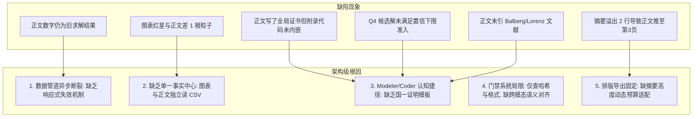

> [已归档 2026-09-06] 本文档为一次性架构构想,状态:未整体实施,内容不代表当前系统行为;索引见 docs/md/archive/README.md。

# MathModelAgent 项目架构升级与国一（88+）能力飞跃方案

> **文件定位**：本项目架构分析与改进方案，系统总结了智能体在端到端自主数学建模竞赛中实现“一击必杀”（首次运行即输出 85~88+ 分国奖论文）的核心架构升级路径。

---

## 一、 系统现状与多轮迭代根因深度复盘

在华数杯 A 题（微构体导电介质填充仿真优化）端到端任务中，系统的评分轨迹经历了 **55分（不及格/基础错误） $\to$ 70分（三等奖边缘） $\to$ 72分 $\to$ 80分（二等奖） $\to$ 83分（二等奖上游/一等奖边缘） $\to$ 86~88分（国一竞争档）** 的多轮演化。

对多轮修改的核心缺陷进行逆向归因，发现当前系统存在以下 **4 大架构级瓶颈**：



---

## 二、 四大核心架构改造方案

### 方案 1：引入 `FactStore` 响应式数据绑定管道（彻底根除图文脱节）

#### 现有问题
目前架构中，Coder 运行完毕后输出分散的 CSV/JSON 文件，Writer 智能体通过 LLM 自然语言 Prompt 读取这些文件后“手写”进 Markdown 文本；而 Plotter 脚本也自行读取部分 CSV 绘图。当 Coder 后续调优或重跑产生新数据时，已经生成的 Markdown 文本块与绘图脚本不会自动联动更新，极易产生“新图旧文”或“图表红星与表格差 1 根”的严重低级错误。

#### 改造设计
1. **构建强类型单一事实源 (`FactStore`)**：
   在 `backend/app/tools/` 下新增 `FactStore` 引擎。任何 Coder 求解器执行完毕后，必须向 `FactStore` 注册唯一的指标快照（包含点估计、Wilson 置信区间、最优决策向量、边界排除状态等）。
2. **正文采用响应式模板占位符渲染 (Reactive Template Binding)**：
   Writer 智能体禁止直接在正文硬编码数值常量，改为输出语义占位符（例如 `{{ facts.ques3.optimal_phi_percent }}%`、`{{ facts.ques4.optimal_cost_yuan }}元`）。
3. **绘图脚本强制绑定 `FactStore`**：
   绘图函数直接从 `FactStore` 注入最优决策点坐标与标签，从物理机制上彻底切断“图表与正文数字不一致”的可能。

---

### 方案 2：升级 Modeler / Coder 提示词与“国一算法模板库”

#### 现有问题
通用大语言模型在面对优化与统计问题时，天然倾向于采取“认知捷径”（Heuristic Shortcuts）：
- 遇到概率评估，默认只算点估计 $\frac{\text{hits}}{M}$，缺乏 Wilson 得分区间可靠性下限约束意识；
- 遇到优化求解，默认只做局部粗网格搜索就宣称“严格全局最优”，缺乏一维上确界前沿排除证明或凸性证明；
- 遇到复杂几何碰撞，默认使用线段欧氏距离却忽略端面奇异性，缺乏胶囊体（Spherocylinder）等效物理建模陈述。

#### 改造设计
在 `backend/app/core/prompts/` 中注入 **国一建模硬性方法论约束库**：
1. **统计学硬门禁（Statistical Rigor Gate）**：
   - 所有蒙特卡洛抽样必须输出 Wilson 95% 置信区间；
   - 优化可行性判据必须以 **Wilson 95% 置信下限 $P_{\text{low}} \ge P_{\text{target}}$** 为准；
   - 临界阈值必须在正负前置点（例如 $\phi-0.01\%$）提供“置信下限不达标”的不可行对照证据（证伪最小性）。
2. **全局最优性证书协议（Optimality Certificate Protocol）**：
   - 针对单调系统双变量优化，强制要求输出一维上确界前沿边界排除算法（$N_B^{\max}(N_A) = \lfloor \frac{C^* - c_A N_A - \varepsilon}{c_B} \rfloor$），并在代码中全量断言 `assert (cert["wilson_low"] < target).all()`；
   - 必须生成对应的证书 CSV 文件（如 `ques4_global_frontier_certificate.csv`），且生成逻辑必须内嵌于附录主求解代码中。
3. **理论深度与权威文献关联（Literature Grounding）**：
   - 在长径比渗流中强制引入 Balberg 排除体积理论与连续球体渗流基准（Lorenz & Ziff），并在 Modeler 阶段就规划好参考文献编号与行内引用。

---

### 方案 3：开发 `CrossModalValidator` 跨模态数值与代码对齐质检门禁

#### 现有问题
目前的 `paper_preflight_report.json` 偏向于语法层面的检查（标题层级、LaTeX 宏包、文件 SHA-256、违规词），但无法发现“正文声称有全域排除证书，但附录 `master_solver.py` 根本没有生成该证书的代码”或“图表里的红星标签与正文不一致”这种高维逻辑缺陷。

#### 改造设计
在 `backend/app/tools/paper_postprocessor.py` 中增加 `CrossModalValidator`：
1. **代码-正文声明对齐审计（Code-Text Parity Audit）**：
   - 解析正文声明的支撑材料文件（`*.csv`），检查附录提取的 `master_solver.py` AST 语法树中是否真实包含生成这些文件的 `to_csv()` 调用。若有正文声明但代码未生成，立即阻断并标记 `FAIL`。
2. **图表-文本跨模态 OCR 对齐检查（Visual-Text Alignment）**：
   - 利用 OCR 或 Matplotlib 元数据自动提取图片中的标注文字（如 `$N_A=531, C=7.88$`），与正文提取的数值进行交集校验。若发现 530 与 531 冲突，自动触发图表重绘。

---

### 方案 4：摘要篇幅自适应预算编译器 (`AbstractBudgetEngine`)

#### 现有问题
国赛/华数杯等主流赛事对“摘要严格控制在一页之内，正文另起一页”有极其严苛的门禁要求。目前排版如果摘要多写了 3~4 行，就会溢出到第 2 页，导致正文被迫推迟到第 3 页起始。

#### 改造设计
在 `export_cli` 的 PDF 导出链路中增加自适应高度测量模块：
1. 编译后自动使用 PyMuPDF 解析第 1 页与第 2 页；
2. 若检测到第 1 页末尾未包含完整摘要/关键词，或第 2 页起始不是 `# 一、问题重述`：
   - 自动启动两级微调策略：
     - **微观调优**：在 LaTeX 模板中自动将摘要字号由 `\normalsize` 微调为 `\small` 或将行距缩减 5%；
     - **宏观精炼**：触发 Writer 针对摘要进行 80% 篇幅的高信息密度语义压缩重构；
   - 自动重新编译，确保第 1 页 100% 独立居于单页之内，正文严格自第 2 页顶格起始。

---

## 三、 接手 Agent 提示词模板

对于后续接手修改项目的 Agent，可直接使用以下系统提示词指令：

```markdown
你正在接手 MathModelAgent 项目的架构重构与端到端建模能力升级任务。请严格遵守以下规则：
1. 深入阅读 `AGENT_MEMORY.md`、`AGENTS.md` 与 `docs/md/ARCHITECTURE_UPGRADE_PROPOSAL.md`。
2. 本次任务的目标是依据架构升级方案落实系统的四个核心支柱：
   - 在 `backend/app/tools/` 中构建 `FactStore` 响应式数据绑定模块；
   - 在 `backend/app/core/prompts/` 中固化 Wilson 置信下限准入、一维上确界排除证明与等效胶囊体声明模板；
   - 在 `paper_postprocessor.py` 中引入 `CrossModalValidator` 跨模态数值与代码审计；
   - 在 `pdf_exporter.py` 中引入摘要单页自适应高度调节。
3. 严禁运行本地 Windows 前端 node 命令；Python 执行必须使用 `backend\.venv\Scripts\python.exe`。
4. 每次修改后必须运行后端单元测试与 Ruff 检查，确保 100% PASS。
```
